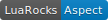

Aspect Lua Template
===================

Aspect is a template language for Lua and OpenResty. No dependencies. Pure Lua.

Aspect uses a syntax similar to the Twig, Django and Jinja template languages which
inspired the Aspect runtime environment.

More Information
----------------

Read the [documentation](https://unifire-app.github.io/aspect/) for more information.

**For template designers:**

- [Specification](./docs/spec.md)
- [Template Syntax](./docs/syntax.md)
- [Operators](./docs/syntax.md#operators)
- [Tags](./docs/tags.md)
- [Filters](./docs/filters.md)
- [Functions](./docs/funcs.md)
- [Tests](./docs/tests.md)

**For developers:**

- [Lua API](./docs/api.md)
- [CLI](./docs/cli.md)
- [Extending](./docs/api.md#extending)
- [Changelog](./changelog.md)
